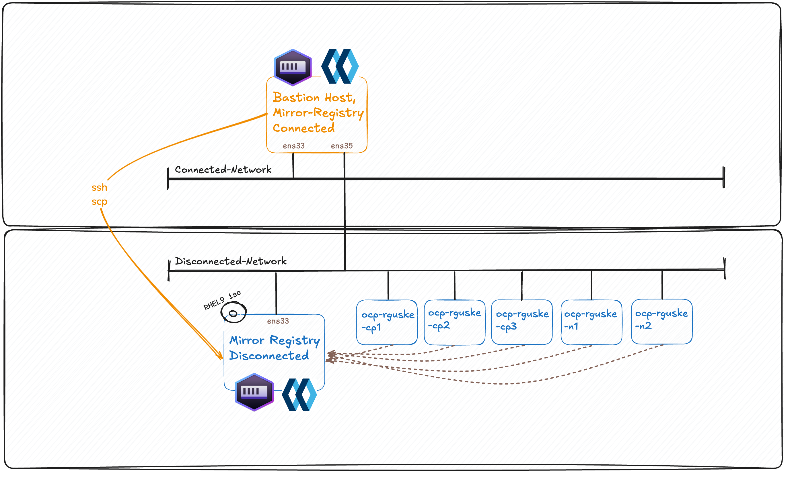
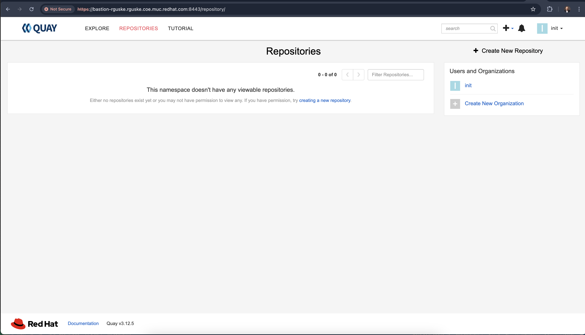
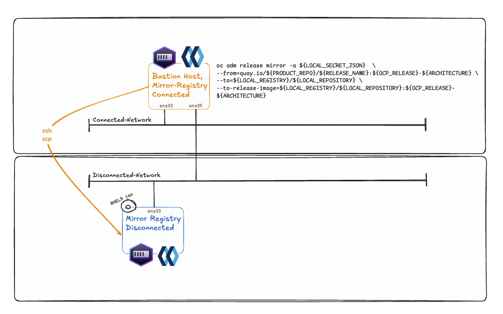
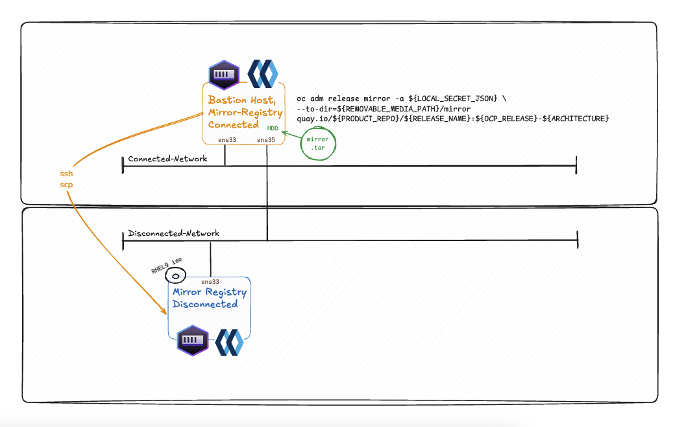
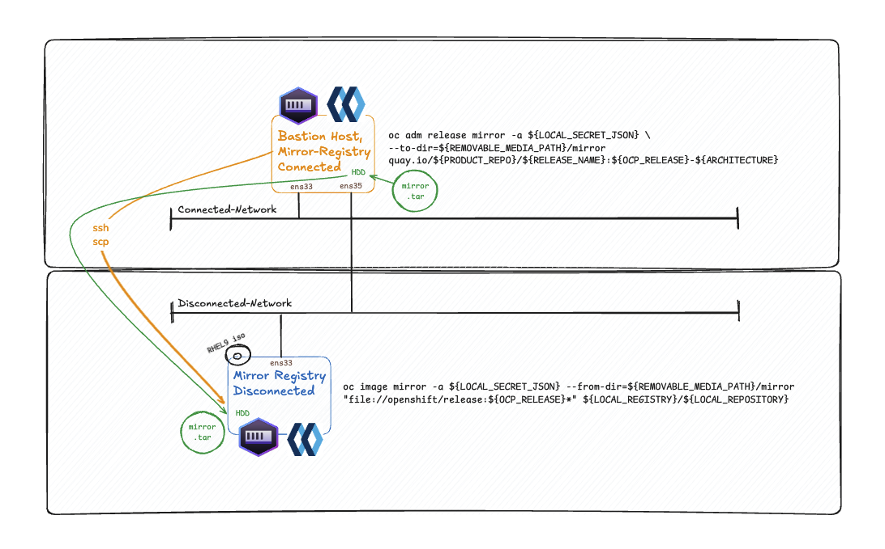

# Installing OpenShift in an air-gapped environment using the Agent-Based Installer

A disconnected environment is an environment that does not have full access to the internet.

OpenShift Container Platform is designed to perform many automatic functions that depend on an internet connection, such as retrieving release images from a registry or retrieving update paths and recommendations for the cluster. Without a direct internet connection, you must perform additional setup and configuration for your cluster to maintain full functionality in the disconnected environment.

Source: [Understanding disconnected installation mirroring](https://docs.redhat.com/en/documentation/openshift_container_platform/4.17/html/installing_an_on-premise_cluster_with_the_agent-based_installer/understanding-disconnected-installation-mirroring)

---
- [Installing OpenShift in an air-gapped environment using the Agent-Based Installer](#installing-openshift-in-an-air-gapped-environment-using-the-agent-based-installer)
  - [How it works](#how-it-works)
  - [Connected Mirroring vs Disconnected Mirroring](#connected-mirroring-vs-disconnected-mirroring)
  - [Bastion Host Preperation](#bastion-host-preperation)
    - [Networking](#networking)
    - [SSH](#ssh)
    - [RHEL Subscription Manager](#rhel-subscription-manager)
    - [Command Line Interfaces (CLIs)](#command-line-interfaces-clis)
    - [Install Podman and Nmstate](#install-podman-and-nmstate)
  - [Installing the Mirror Registry on the Bastion Host](#installing-the-mirror-registry-on-the-bastion-host)
    - [Validating the installation](#validating-the-installation)
    - [Login into the Mirror Registry](#login-into-the-mirror-registry)
    - [Uninstalling the Mirror Registry](#uninstalling-the-mirror-registry)
  - [Mirroring Images](#mirroring-images)
    - [Option 1 - Mirror the images to the local mirror registry](#option-1---mirror-the-images-to-the-local-mirror-registry)
    - [Option 2 - Store Mirror-Images in a File](#option-2---store-mirror-images-in-a-file)
  - [Preparing the disconneted Registry](#preparing-the-disconneted-registry)
    - [SSH on the Mirror-Registry](#ssh-on-the-mirror-registry)
    - [Installing Podman Offline](#installing-podman-offline)
  - [Install the Mirrored Registry](#install-the-mirrored-registry)
    - [Upload the mirrored images (mirror.tar)](#upload-the-mirrored-images-mirrortar)
    - [Create the necessary section for the `install-config.yaml`](#create-the-necessary-section-for-the-install-configyaml)
  - [Cluster Preperations](#cluster-preperations)
  - [Configurations](#configurations)
  - [Create Agent iso](#create-agent-iso)
  - [Run a `httpd` webserver on the bastion to share the iso](#run-a-httpd-webserver-on-the-bastion-to-share-the-iso)

---

## How it works

You can use a mirror registry for disconnected installations and to ensure that your clusters only use container images that satisfy your organization’s controls on external content. Before you install a cluster on infrastructure that you provision in a disconnected environment, you must mirror the required container images into that environment. To mirror container images, you must have a registry for mirroring.

## Connected Mirroring vs Disconnected Mirroring

**Connected Mirroring** is if you have a host that can access both the internet and your mirror registry, but not your cluster nodes, you can directly mirror the content from that machine.

**Disconnected Mirroring** is if you have no such host, you must mirror the images to a file system and then bring that host or removable media into your restricted environment.

## Bastion Host Preperation

### Networking

Setup a Bastion Host with two nics. One is connected to the "internet-zone" and the other one to the disconnected network.



Configure the interfaces accordingly:

Configure the interface which has internet connection:

```bash
nmcli con mod ens33 ipv4.addresses 10.32.96.138/20
nmcli con mod ens33 ipv4.gateway 10.32.111.254
nmcli con mod ens33 ipv4.dns "10.32.96.1,10.32.96.31"
nmcli con mod ens33 ipv4.method manual
```

Configure the interface which is connected to the disconnected network:

```bash
nmcli con mod ens35 ipv4.addresses 192.168.69.208/24
nmcli con mod ens35 ipv4.method manual
```

Bring both interfaces up:

```bash
nmcli con up ens33
nmcli con up ens35
```

The configuration is stored under:

```bash
tree /etc/NetworkManager/system-connections/
/etc/NetworkManager/system-connections/
├── ens33.nmconnection
└── ens35.nmconnection
```

Readable configuration:

```bash
[connection]
id=ens33
uuid=3032436c-0c31-3c2e-b3ec-a8baf3fde9fd
type=ethernet
autoconnect-priority=-999
interface-name=ens33
timestamp=1740856507
zone=public

[ethernet]

[ipv4]
address1=10.32.96.138/20,10.32.111.254
dns=10.32.96.1;10.32.96.31;
method=manual

[ipv6]
addr-gen-mode=eui64
method=auto

[proxy]
```

And the other interface:

```bash
[connection]
id=ens35
uuid=71d46c9a-0b20-4244-ba4c-c2999dcedd02
type=ethernet
interface-name=ens35
timestamp=1740597382
zone=public

[ethernet]

[ipv4]
address1=192.168.69.208/24,10.32.111.254
dns=192.168.68.6;10.32.96.1;
method=manual

[ipv6]
addr-gen-mode=default
method=auto

[proxy]
```

Enable IP Forwarding: `sysctl -w net.ipv4.ip_forward=1`

This allows the VM to forward packets between interfaces.

Make it permanently:

```bash
vi /etc/sysctl.conf
net.ipv4.ip_forward = 1
```

Apply the changes: `sysctl -p`

Allow forwarding:

`firewall-cmd --permanent --add-forward-port=port=22:proto=tcp:toport=22`

Add trusted zones for both interfaces:

```bash
firewall-cmd --permanent --zone=trusted --add-interface=ens35
firewall-cmd --permanent --zone=public --add-interface=ens33
```

Reload firewall rules: `firewall-cmd --reload`

Configure Routing (if needed).

If devices in 192.168.69.0/24 need internet access via the VM, you need NAT:

```bash
sudo firewall-cmd --permanent --add-masquerade
sudo firewall-cmd --reload
```

Check IP forwarding: `cat /proc/sys/net/ipv4/ip_forward`

### Change the hostname of two bastions
Machine 1 (bastion-mirror.co.local)

```bash
sudo hostnamectl set-hostname bastion-mirror.co.local
sudo sed -i 's/^127.0.0.1.*/127.0.0.1   bastion-mirror.co.local localhost/' /etc/hosts
sudo systemctl restart systemd-hostnamed
```

✅ Machine 2 (bastion-mirror.disco.local)
```bash
sudo hostnamectl set-hostname bastion-mirror.disco.local
sudo sed -i 's/^127.0.0.1.*/127.0.0.1   bastion-mirror.disco.local localhost/' /etc/hosts
sudo systemctl restart systemd-hostnamed
```

✅ Verify
```bash
hostnamectl
hostname -f
```


### SSH

Configure `ssh`:
- Generating an SSH key pair on your Bastion-Host. You can use this key pair to authenticate into the OpenShift Container Platform cluster’s nodes after it is deployed.

`ssh-keygen -t ed25519 -N '' -f ~/.ssh/id_ed25519`

`cat ~/.ssh/id_ed25519.pub | ssh rguske@bastion-rguske.rguske.coe.muc.redhat.com "mkdir -p ~/.ssh && cat >> ~/.ssh/authorized_keys && chmod 600 ~/.ssh/authorized_keys && chmod 700 ~/.ssh"`

### RHEL Subscription Manager

Configure RHEL Subscription Manager:

`sudo subscription-manager register --username --password '' --auto-attach`

### Command Line Interfaces (CLIs)

On the bastion host, download the necessary cli's from [Homepage](https://console.redhat.com/openshift/downloads):

You could use `curl -LO <url>` for it:

OpenShift Installer: `curl -LO https://mirror.openshift.com/pub/openshift-v4/clients/ocp/4.17.6/openshift-install-rhel9-amd64.tar.gz`

OpenShift Client: `curl -LO https://mirror.openshift.com/pub/openshift-v4/clients/ocp/4.17.6/openshift-client-linux-amd64-rhel9-4.17.6.tar.gz`

The "mirror" plugin for the OpenShift CLI client (oc) controls the process of mirroring all relevant container image for a full disconnected OpenShift installation in a central, declarative tool. Learn more(new window or tab)

RHEL 9 is FIPS compatible; RHEL 8 is non-FIPS compatible.

OpenShift Mirror CLI: `curl -LO https://mirror.openshift.com/pub/openshift-v4/x86_64/clients/ocp/latest/oc-mirror.rhel9.tar.gz`

Download and install a local, minimal single instance deployment of Red Hat Quay to aid bootstrapping the first disconnected cluster.

OpenShift Tiny Quay Registry: `curl -LO https://mirror.openshift.com/pub/cgw/mirror-registry/latest/mirror-registry-amd64.tar.gz`

This is how it should like if you've downloaded all:

```code
[rguske@bastion-rguske tools]$ tree
.
├── clis
│   ├── oc-mirror.rhel9.tar.gz
│   ├── openshift-client-linux-amd64-rhel9-4.17.6.tar.gz
│   └── openshift-install-rhel9-amd64.tar.gz
└── mirror-registry
    ├── execution-environment.tar
    ├── image-archive.tar
    ├── mirror-registry-amd64.tar.gz
    ├── README.md
    └── sqlite3.tar
```

Unpack the `.gz` files, except execution-environment.tar, image-archive.tar and sqlite3.tar of the folder mirror-registry and move them into `/usr/local/bin`:
or you can use >> sudo install -m 755 oc-mirror /usr/local/bin/ 

```code
tree /usr/local/bin
/usr/local/bin
├── dstp
├── execution-environment.tar
├── image-archive.tar
├── kubectl
├── mirror-registry
├── oc
├── oc-mirror
├── openshift-install
└── sqlite3.tar

0 directories, 9 file
```

If /usr/local/bin isn't included in the `$PATH`, run
`export PATH=/usr/local/bin:$PATH`

### Install Podman and Nmstate

In order to run the mirror registry, the bastion host needs a container-runtime installed.

Podman is the runtime of choice and is included in the `container-tools` package.

Install it via `dnf install container-tools -y`.

The installer also uses `nmstatectl` for the creation of the agent.iso. Install it via `dnf install nmstate -y`. Otherwise, you'll get the error:

```code
FATAL   * failed to validate network yaml for host 0, install nmstate package, exec: "nmstatectl": executable file not found in $PATH
```

## Installing the Mirror Registry on the Bastion Host

You can use any container registry that supports Docker v2-2, such as Red Hat Quay, the mirror registry for Red Hat OpenShift, Artifactory, Sonatype Nexus Repository, or Harbor.

> The OpenShift image registry cannot be used as the target registry because it does not support pushing without a tag, which is required during the mirroring process.

Install the mirror registry:

```code
[root@bastion-rguske mirror-registry]# ./mirror-registry install --quayHostname $(hostname -f) --quayRoot '/home/rguske/tools/mirror-registry/root' --initPassword 'r3dh4t1!' --verbose

   __   __
  /  \ /  \     ______   _    _     __   __   __
 / /\ / /\ \   /  __  \ | |  | |   /  \  \ \ / /
/ /  / /  \ \  | |  | | | |  | |  / /\ \  \   /
\ \  \ \  / /  | |__| | | |__| | / ____ \  | |
 \ \/ \ \/ /   \_  ___/  \____/ /_/    \_\ |_|
  \__/ \__/      \ \__
                  \___\ by Red Hat
 Build, Store, and Distribute your Containers

INFO[2025-02-18 19:04:32] Install has begun
DEBU[2025-02-18 19:04:32] Ansible Execution Environment Image: quay.io/quay/mirror-registry-ee:latest
DEBU[2025-02-18 19:04:32] Pause Image: registry.access.redhat.com/ubi8/pause:8.10-5
DEBU[2025-02-18 19:04:32] Quay Image: registry.redhat.io/quay/quay-rhel8:v3.12.5
DEBU[2025-02-18 19:04:32] Redis Image: registry.redhat.io/rhel8/redis-6:1-190
INFO[2025-02-18 19:04:32] Found execution environment at /home/rguske/tools/mirror-registry/execution-environment.tar
INFO[2025-02-18 19:04:32] Loading execution environment from execution-environment.tar
DEBU[2025-02-18 19:04:32] Importing execution environment with command: /bin/bash -c /usr/bin/podman image import \
                                        --change 'ENV PATH=/usr/local/sbin:/usr/local/bin:/usr/sbin:/usr/bin:/sbin:/bin' \
                                        --change 'ENV HOME=/home/runner' \
                                        --change 'ENV container=oci' \
                                        --change 'ENTRYPOINT=["entrypoint"]' \
                                        --change 'WORKDIR=/runner' \
                                        --change 'EXPOSE=6379' \
                                        --change 'VOLUME=/runner' \
                                        --change 'CMD ["ansible-runner", "run", "/runner"]' \
                                        - quay.io/quay/mirror-registry-ee:latest < /home/rguske/tools/mirror-registry/execution-environment.tar
Getting image source signatures
Copying blob 6c18bbba5eae skipped: already exists
Copying config 89ddb068cb done   |
Writing manifest to image destination
sha256:89ddb068cbda13bef116a6a6eae687549a249c610eb23388c7d56f6b87a2be4b
INFO[2025-02-18 19:04:38] Detected an installation to localhost

[...]

PLAY RECAP **********************************************************************************************************************************************************************************************************************************
root@bastion-rguske.rguske.coe.muc.redhat.com : ok=48   changed=27   unreachable=0    failed=0    skipped=16   rescued=0    ignored=0

INFO[2025-02-18 19:08:31] Quay installed successfully, config data is stored in /home/rguske/tools/mirror-registry/root
INFO[2025-02-18 19:08:31] Quay is available at https://bastion-rguske.rguske.coe.muc.redhat.com:8443 with credentials (init, r3dh4t1!)
```

Alternative customizations examples:

1.: `mirror-registry install --quayHostname $(hostname -f) --quayRoot '/home/rguske/tools/mirror-registry/root'`

2.: `/mirror-registry install --quayHostname mirror.example.org --sslKey tls.key --targetHostname internal.mirror --quayRoot /var/mirror-registry --initPassword changeme`

Source: [Mirror registry for Red Hat OpenShift flags](https://docs.redhat.com/en/documentation/openshift_container_platform/4.17/html-single/disconnected_environments/index#uninstalling-mirror-registry_installing-mirroring-creating-registry).

### Validating the installation

Validating the endpoint using `curl`:

```code
curl -k https://bastion-rguske.rguske.coe.muc.redhat.com:8443/health/instance

{"data":{"services":{"auth":true,"database":true,"disk_space":true,"registry_gunicorn":true,"service_key":true,"web_gunicorn":true}},"status_code":200}
```

Checking the certificate:

```code
echo | openssl s_client -connect bastion-rguske.rguske.coe.muc.redhat.com:8443 -showcerts

Connecting to 10.32.96.138
CONNECTED(00000005)
depth=1 C=US, ST=VA, L=New York, O=Quay, OU=Division, CN=bastion-rguske.rguske.coe.muc.redhat.com
verify error:num=19:self-signed certificate in certificate chain
verify return:1
depth=1 C=US, ST=VA, L=New York, O=Quay, OU=Division, CN=bastion-rguske.rguske.coe.muc.redhat.com
verify return:1
depth=0 CN=quay-enterprise
verify return:1
---
Certificate chain
 0 s:CN=quay-enterprise
   i:C=US, ST=VA, L=New York, O=Quay, OU=Division, CN=bastion-rguske.rguske.coe.muc.redhat.com
   a:PKEY: rsaEncryption, 2048 (bit); sigalg: RSA-SHA256
   v:NotBefore: Feb 18 18:05:41 2025 GMT; NotAfter: Feb  9 18:05:41 2026 GMT
-----BEGIN CERTIFICATE-----

[...]
```

Also, validate the certificate which we are going trust on our bastion host.

```code
openssl x509 -in root/quay-config/ssl.cert -text -noout
Certificate:
    Data:
        Version: 3 (0x2)
        Serial Number:
            1b:4a:63:52:f7:7b:34:ab:0f:8d:75:83:2f:47:19:51:ea:49:8d:4a
        Signature Algorithm: sha256WithRSAEncryption
        Issuer: C = US, ST = VA, L = New York, O = Quay, OU = Division, CN = bastion-rguske.rguske.coe.muc.redhat.com
        Validity
            Not Before: Feb 18 18:05:41 2025 GMT
            Not After : Feb  9 18:05:41 2026 GMT

[...]
```

Systemd auto-start is also configured:

```code
sudo systemctl list-units --type service | grep quay
  quay-app.service                                      loaded active running Quay Container
  quay-pod.service                                      loaded active exited  Infra Container for Quay
  quay-redis.service                                    loaded active running Redis Podman Container for Quay
```

### Login into the Mirror Registry

```code
podman login -u init -p 'r3dh4t1!' https://bastion-rguske.rguske.coe.muc.redhat.com:8443 --tls-verify=false
```

It is also possible without using the option `--tls-verify=false` by trusting the newly created certificates which are stored in `root` / `quay-config`:

```code
[rguske@bastion-rguske mirror-registry]$ tree
.
├── execution-environment.tar
├── image-archive.tar
├── mirror-registry
├── mirror-registry-amd64.tar.gz
├── pause.tar
├── quay.tar
├── README.md
├── redis.tar
├── root
│   ├── quay-config
│   │   ├── config.yaml
│   │   ├── openssl.cnf
│   │   ├── ssl.cert
│   │   ├── ssl.csr
│   │   └── ssl.key
│   └── quay-rootCA
│       ├── rootCA.key
│       └── rootCA.pem
└── sqlite3.tar
```

Copy the certs:

`cp root/quay-config/ssl.cert /etc/pki/ca-trust/source/anchors/`

```code
tree /etc/pki/ca-trust/source/anchors/
└── ssl.cert

0 directories, 1 file
```

Update the trust:

`update-ca-trust`

Logout:

```code
podman logout https://bastion-rguske.rguske.coe.muc.redhat.com:8443

Removed login credentials for bastion-rguske.rguske.coe.muc.redhat.com:8443
```

Login again:

```code
podman login -u init -p 'r3dh4t1!' 'https://bastion-rguske.rguske.coe.muc.redhat.com:8443'

Login Succeeded!
```

Browsing the Quay mirror-registry:



### Uninstalling the Mirror Registry

`mirror-registry uninstall`

## Mirroring Images

> You must have access to the internet to obtain the necessary container images. In this procedure, you place your mirror registry on a mirror host that has access to both your network and the internet. If you do not have access to a mirror host, use the [Mirroring Operator catalogs](https://docs.redhat.com/en/documentation/openshift_container_platform/4.17/html-single/disconnected_environments/index#olm-mirror-catalog_installing-mirroring-installation-images) for use with disconnected clusters procedure to copy images to a device you can move across network boundaries with.

Procedure and prerequisites:

- You configured a mirror registry to use in your disconnected environment.
- You identified an image repository location on your mirror registry to mirror images into.
- You provisioned a mirror registry account that allows images to be uploaded to that image repository.
- You have write access to the mirror registry.

Obtain your [pull secret from Red Hat OpenShift Cluster Manager](https://console.redhat.com/openshift/install/pull-secret) and paste the data into a `json` file.

Make a copy of your pull secret in JSON format by running the following command:

`cat pull_secret | jq . > $(pwd)/pull_secret.json`

Example:

```json
{
  "auths": {
    "cloud.openshift.com": {
      "auth": "b3BlbnNo...",
      "email": "you@example.com"
    },
    "quay.io": {
      "auth": "b3BlbnNo...",
      "email": "you@example.com"
    },
    "registry.connect.redhat.com": {
      "auth": "NTE3Njg5Nj...",
      "email": "you@example.com"
    },
    "registry.redhat.io": {
      "auth": "NTE3Njg5Nj...",
      "email": "you@example.com"
    }
  }
}
```

Next up is to generate the base64-encoded user name and password or token for your mirror registry by running the following command:

`echo -n '<user_name>:<password>' | base64 -w0`

For <user_name> and <password>, specify the user name and password that you configured for your registry.

Edit the JSON file and add a section that describes your registry to it:

```json
  "auths": {
    "bastion-rguske.rguske.coe.muc.redhat.com:8443": {
      "auth": "<base64 credentials>",
      "email": "you@example.com"
    }
  },
```

Mirror the OpenShift Container Platform image repository to your registry to use during cluster installation or upgrade.

Determine the desired OpenShift version via [OpenShift Container Platform downloads page](https://access.redhat.com/downloads/content/290/).

Example: `4.17.16`

1. Export the release version: `export OCP_RELEASE='4.17.16'`
2. Export the local registry name and host port: `export LOCAL_REGISTRY='bastion-rguske.rguske.coe.muc.redhat.com:8443'`
3. Export the local repository name: `export LOCAL_REPOSITORY='ocp4/openshift4'`
4. Export the name of the repository to mirror: `export PRODUCT_REPO='openshift-release-dev'`
5. Export the path to your registry pull secret: `export LOCAL_SECRET_JSON='/home/rguske/tools/mirror-registry/mirroring/pull_secret.json'`
6. Export the release mirror: `export RELEASE_NAME='ocp-release'`
7. Export the type of architecture for your cluster: `export ARCHITECTURE='x86_64'`

### Option 1 - Mirror the images to the local mirror registry



Run the image-mirror process dry run:

```code
oc adm release mirror -a ${LOCAL_SECRET_JSON}  \
--from=quay.io/${PRODUCT_REPO}/${RELEASE_NAME}:${OCP_RELEASE}-${ARCHITECTURE} \
--to=${LOCAL_REGISTRY}/${LOCAL_REPOSITORY} \
--to-release-image=${LOCAL_REGISTRY}/${LOCAL_REPOSITORY}:${OCP_RELEASE}-${ARCHITECTURE} --dry-run
```

Example `--dry-run` output:

```code

[...]

phase 0:
  bastion-rguske.rguske.coe.muc.redhat.com:8443 ocp4/openshift4 blobs=440 mounts=0 manifests=191 shared=4

info: Planning completed in 37.84s
info: Dry run complete

Success
Update image:  bastion-rguske.rguske.coe.muc.redhat.com:8443/ocp4/openshift4:4.17.16-x86_64
Mirror prefix: bastion-rguske.rguske.coe.muc.redhat.com:8443/ocp4/openshift4
Mirror prefix: bastion-rguske.rguske.coe.muc.redhat.com:8443/ocp4/openshift4:4.17.16-x86_64

To use the new mirrored repository to install, add the following section to the install-config.yaml:

imageContentSources:
- mirrors:
  - bastion-rguske.rguske.coe.muc.redhat.com:8443/ocp4/openshift4
  source: quay.io/openshift-release-dev/ocp-release
- mirrors:
  - bastion-rguske.rguske.coe.muc.redhat.com:8443/ocp4/openshift4
  source: quay.io/openshift-release-dev/ocp-v4.0-art-dev


To use the new mirrored repository for upgrades, use the following to create an `ImageContentSourcePolicy`:

apiVersion: operator.openshift.io/v1alpha1
kind: ImageContentSourcePolicy
metadata:
  name: example
spec:
  repositoryDigestMirrors:
  - mirrors:
    - bastion-rguske.rguske.coe.muc.redhat.com:8443/ocp4/openshift4
    source: quay.io/openshift-release-dev/ocp-release
  - mirrors:
    - bastion-rguske.rguske.coe.muc.redhat.com:8443/ocp4/openshift4
    source: quay.io/openshift-release-dev/ocp-v4.0-art-dev
```

**Now** without the `--dry-run` option:

```code
oc adm release mirror -a ${LOCAL_SECRET_JSON}  \
--from=quay.io/${PRODUCT_REPO}/${RELEASE_NAME}:${OCP_RELEASE}-${ARCHITECTURE} \
--to=${LOCAL_REGISTRY}/${LOCAL_REPOSITORY} \
--to-release-image=${LOCAL_REGISTRY}/${LOCAL_REPOSITORY}:${OCP_RELEASE}-${ARCHITECTURE}
```

This command pulls the release information as a digest, and its output includes the `imageContentSources` data that you require when you install your cluster.

Examople output:

```code

[...]

sha256:d5fcfe5b11c4bf72e4948de4afd5c8b0e620a53bd2cd6d677236568a89de1d85 bastion-rguske.rguske.coe.muc.redhat.com:8443/ocp4/openshift4:4.17.16-x86_64-multus-whereabouts-ipam-cni
sha256:cf073f3284a1571d2e9641958bccaa033a1183dda441e94097efb3778e0bd240 bastion-rguske.rguske.coe.muc.redhat.com:8443/ocp4/openshift4:4.17.16-x86_64-gcp-machine-controllers
info: Mirroring completed in 12m31.32s (26.77MB/s)

Success
Update image:  bastion-rguske.rguske.coe.muc.redhat.com:8443/ocp4/openshift4:4.17.16-x86_64
Mirror prefix: bastion-rguske.rguske.coe.muc.redhat.com:8443/ocp4/openshift4
Mirror prefix: bastion-rguske.rguske.coe.muc.redhat.com:8443/ocp4/openshift4:4.17.16-x86_64

To use the new mirrored repository to install, add the following section to the install-config.yaml:

imageContentSources:
- mirrors:
  - bastion-rguske.rguske.coe.muc.redhat.com:8443/ocp4/openshift4
  source: quay.io/openshift-release-dev/ocp-release
- mirrors:
  - bastion-rguske.rguske.coe.muc.redhat.com:8443/ocp4/openshift4
  source: quay.io/openshift-release-dev/ocp-v4.0-art-dev


To use the new mirrored repository for upgrades, use the following to create an `ImageContentSourcePolicy`:


apiVersion: operator.openshift.io/v1alpha1
kind: ImageContentSourcePolicy
metadata:
  name: example
spec:
  repositoryDigestMirrors:
  - mirrors:
    - bastion-rguske.rguske.coe.muc.redhat.com:8443/ocp4/openshift4
    source: quay.io/openshift-release-dev/ocp-release
  - mirrors:
    - bastion-rguske.rguske.coe.muc.redhat.com:8443/ocp4/openshift4
    source: quay.io/openshift-release-dev/ocp-v4.0-art-dev
```

Record the entire `imageContentSources` section from the output of the previous command. The information about your mirrors is unique to your mirrored repository, and you must add the `imageContentSources` section to the install-config.yaml file during installation.

If the local container registry is connected to the mirror host, run the following command:

`oc adm release extract -a ${LOCAL_SECRET_JSON} --command=openshift-install "${LOCAL_REGISTRY}/${LOCAL_REPOSITORY}:${OCP_RELEASE}-${ARCHITECTURE}"`

### Option 2 - Store Mirror-Images in a File



Example: `4.17.16`

1. Export the release version: `export OCP_RELEASE='4.17.16'`
2. Export the name of the repository to mirror: `export PRODUCT_REPO='openshift-release-dev'`
3. Export the path to your registry pull secret: `export LOCAL_SECRET_JSON='/home/rguske/tools/mirror-registry/mirroring/pull_secret.json'`
4. Export the release mirror: `export RELEASE_NAME='ocp-release'`
5. Export the type of architecture for your cluster: `export ARCHITECTURE='x86_64'`
6. Export the path to the directory to host the mirrored images: `REMOVABLE_MEDIA_PATH='/home/rguske/tools/mirror-registry/files/'`

Run a `--dry-run` first: `oc adm release mirror -a ${LOCAL_SECRET_JSON} --to-dir=${REMOVABLE_MEDIA_PATH}/mirror quay.io/${PRODUCT_REPO}/${RELEASE_NAME}:${OCP_RELEASE}-${ARCHITECTURE} --dry-run`

The output includes also the command, how to upload the file into the disconnected Mirror-Registry.

Example:

```code

[...]

      sha256:fdbd712a9f40a59d72ef856e9769d025adced12ea1cf4f7e5cc1531648dedb80 -> 4.17.16-x86_64-ibm-cloud-controller-manager
      sha256:ff0f1633d8a71bc0093c3981f9f96cfee6c697c8e494ec88932d44fdafa6b437 -> 4.17.16-x86_64-cluster-autoscaler
      sha256:ffc7682846d663106e2851e01b328aeb7a1c31b9db93db53e8f3b43b76767587 -> 4.17.16-x86_64-driver-toolkit
  stats: shared=4 unique=436 size=18.73GiB ratio=0.99

phase 0:
   openshift/release blobs=440 mounts=0 manifests=191 shared=4

info: Planning completed in 38.31s
info: Dry run complete

Success
Update image:  openshift/release:4.17.16-x86_64

To upload local images to a registry, run:

    oc image mirror --from-dir=/home/rguske/tools/mirror-registry/files//mirror 'file://openshift/release:4.17.16-x86_64*' REGISTRY/REPOSITORY

info: Write configmap signature file /home/rguske/tools/mirror-registry/files/mirror/config/signature-sha256-e0907823bc8989b0.json
```

## Preparing the disconneted Registry

### SSH on the Mirror-Registry

Generating an SSH key pair on your disconnected-registry. You can use this key pair to authenticate into the OpenShift Container Platform cluster’s nodes after it is deployed.

`ssh-keygen -t ed25519 -N '' -f ~/.ssh/id_ed25519`

### Installing Podman Offline

1. Mount a RHEL installation iso file to the system (VM or BM via Board Management Controller).

Check e.g. with `lsblk` for the disconnected "cdrom" (iso) device:

```bash
[root@mirror-rguske ~]# lsblk
NAME          MAJ:MIN RM   SIZE RO TYPE MOUNTPOINTS
sda             8:0    0   120G  0 disk
├─sda1          8:1    0   600M  0 part /boot/efi
├─sda2          8:2    0     1G  0 part /boot
└─sda3          8:3    0 118.4G  0 part
  ├─rhel-root 253:0    0    70G  0 lvm  /
  ├─rhel-swap 253:1    0   7.9G  0 lvm  [SWAP]
  └─rhel-home 253:2    0  40.5G  0 lvm  /home
sr0            11:0    1    11G  0 rom
```

2. Create a folder in which the iso content will be accessible:

`mkdir -p /mnt/rhel-iso`

3. Mount the connected iso accordingly:

`mount -o loop /path/to/rhel.iso /mnt/rhel-iso`

Example in my case with a VM: `mount -o loop /dev/sr0 /mnt/rhel-iso`

4. Create a Local Repository:

```code
cat <<EOF | tee /etc/yum.repos.d/rhel9-iso.repo
[rhel9-iso-BaseOS]
name=RHEL9-ISO-BaseOS
baseurl=file:///mnt/rhel-iso/BaseOS/
enabled=1
gpgcheck=0

[rhel9-iso-AppStream]
name=RHEL9-ISO-AppStream
baseurl=file:///mnt/rhel-iso/AppStream/
enabled=1
gpgcheck=0
EOF
```

5. Install Podman and `nmstate`

`dnf install podman -y`
`dnf install nmstate -y`

## Install the Mirrored Registry

I've simply `scp`ed the existing files from my bastion host to the mirror registry. Simply follow the installation instructions which are provided in section [Mirror-Registry](#mirror-registry).

Example: `./mirror-registry install --quayHostname $(hostname -f) --quayRoot '/home/rguske/mirror/root' --initPassword 'r3dh4t1!' --verbose`

### Upload the mirrored images (mirror.tar)



Example: `4.17.16`

1. Export the release version: `export OCP_RELEASE='4.17.16'`
2. Export the path to your registry pull secret: `export LOCAL_SECRET_JSON='/root/mirror/pull_secret.json'`
3. Export the local registry name and host port: `export LOCAL_REGISTRY='mirror-rguske.disco.local:8443'`
4. Export the local repository name: `export LOCAL_REPOSITORY='ocp4/openshift4'`
5. Export the path to the directory to host the mirrored images: `REMOVABLE_MEDIA_PATH='/root/mirror/files/'`

```code
export OCP_RELEASE='4.17.16' \
export LOCAL_SECRET_JSON='/root/mirror/pull_secret.json' \
export LOCAL_REGISTRY='mirror-rguske.disco.local:8443' \
export LOCAL_REPOSITORY='ocp4/openshift4' \
REMOVABLE_MEDIA_PATH='/root/mirror/files/'
```

Run a `--dry-run` first: `oc image mirror -a ${LOCAL_SECRET_JSON} --from-dir=${REMOVABLE_MEDIA_PATH}/mirror "file://openshift/release:${OCP_RELEASE}*" ${LOCAL_REGISTRY}/${LOCAL_REPOSITORY} --dry-run`

Output example:

```code
mirror-rguske.disco.local:8443/
  ocp4/openshift4
    blobs:
      file://openshift/release sha256:44d117d635acf411b6b4106c39d1cdcadbe7b7b49d48995c3585269733701f6a 462B
      file://openshift/release sha256:b784c3277c21e7f78587090bfd2b4d24f1c5f8505d1210f4e4175390b3655da8 1.679KiB
      file://openshift/release sha256:8c4004c8d3c8396589d5e843f5815bbc9ceb61ec353566b16f49548f6444dc6b 2.162KiB
      file://openshift/release sha256:9dad063a624b62064bf25dbbc2e802e472d636056f661f2a0be73efd8a4da98b 2.286KiB
      file://openshift/release sha256:214b29fa1526332990ca6413cd27a61f39adabc342b51269d1fa2f7f5a240e22 5.52KiB
      file://openshift/release sha256:7b635424ae23cca4e5456b1a29119f1f8e6914a21673530eb3c8e0bf18713d77 5.866KiB
      file://openshift/release sha256:91fcc15c07381d7757ea0164c9fbcb589160f70ed8360e2e28a44121e6d4aa4b 6.021KiB
      file://openshift/release sha256:b0afd6b557b0e2f07c2e29e8aa3a85941de588ffa9c05282eb987af57693d013 9.431KiB
      file://openshift/release sha256:185568852b898e4fc5c9316ef4c13358dcfaafcdd8e680970e5d12595180e3c1 15.03KiB
      file://openshift/release sha256:c4f9576f0eeffa4d01b6805fbc2b195ebec01a50f0243a37f9424014b2849b0e 15.46KiB
      file://openshift/release sha256:9ca7275efa88a3cf1d26018b616a6e53bad421c1dc6594a5d67e7f45dd17a82f 16.03KiB
      file://openshift/release sha256:a3474d06adb3292aa98f8ac04cedd254c1188ca720fa46ab4329a4e0f2302720 16.33KiB
      file://openshift/release sha256:107c685af2958d2e0e8a6f11c64b269c43755ad121487b230fcb5c23a2f4ab56 17.74KiB
[...]

[...]
      sha256:f5c2ee214868da1dda796d8743c14581f01a8894f0f9c2bb362fda1cad4a0313 -> 4.17.16-x86_64-csi-external-snapshotter
      sha256:f6323d0256ae364c545d8471b34a0f8c10ac4f4a039ea5e141c84718b65feb89 -> 4.17.16-x86_64-oauth-proxy
      sha256:f96d0fc3eab2995460460cf705b935d6b9231fa787680f00a99aec07c8e40e67 -> 4.17.16-x86_64-machine-api-operator
      sha256:f989850dede9f3b12297a9d23a10c494c5cc3536cf09a4318f3640ffa3186f65 -> 4.17.16-x86_64-console
      sha256:f9b760ba1e67e0544fea6493b79c5b08bed512057831028c72c8eafcdd92c423 -> 4.17.16-x86_64-powervs-machine-controllers
      sha256:fc2fb3cef768c9ff2ce5c24467f58d13345efad96bac49ff34952228e8c6100a -> 4.17.16-x86_64-cluster-bootstrap
      sha256:fdb7df38c23a8f1b4579e353141cf71e55b1a413e03ee1e17a4d6493305c9c2f -> 4.17.16-x86_64-csi-snapshot-validation-webhook
      sha256:fdbd712a9f40a59d72ef856e9769d025adced12ea1cf4f7e5cc1531648dedb80 -> 4.17.16-x86_64-ibm-cloud-controller-manager
      sha256:ff0f1633d8a71bc0093c3981f9f96cfee6c697c8e494ec88932d44fdafa6b437 -> 4.17.16-x86_64-cluster-autoscaler
      sha256:ffc7682846d663106e2851e01b328aeb7a1c31b9db93db53e8f3b43b76767587 -> 4.17.16-x86_64-driver-toolkit
  stats: shared=0 unique=440 size=18.73GiB ratio=1.00

phase 0:
  mirror-rguske.disco.local:8443 ocp4/openshift4 blobs=440 mounts=0 manifests=191 shared=0

info: Planning completed in 70ms
info: Dry run complete
```

The output includes also the command, how to upload the file into the disconnected Mirror-Registry.

`oc image mirror --from-dir=${REMOVABLE_MEDIA_PATH}/mirror "file://openshift/release:${OCP_RELEASE}*" ${LOCAL_REGISTRY}/${LOCAL_REPOSITORY}`

Example output:

```code
[root@mirror-rguske mirror]# oc image mirror --from-dir=${REMOVABLE_MEDIA_PATH}/mirror "file://openshift/release:${OCP_RELEASE}*" ${LOCAL_REGISTRY}/${LOCAL_REPOSITORY}
mirror-rguske.disco.local:8443/
  ocp4/openshift4
    blobs:
      file://openshift/release sha256:44d117d635acf411b6b4106c39d1cdcadbe7b7b49d48995c3585269733701f6a 462B
      file://openshift/release sha256:b784c3277c21e7f78587090bfd2b4d24f1c5f8505d1210f4e4175390b3655da8 1.679KiB
[...]

uploading: mirror-rguske.disco.local:8443/ocp4/openshift4 sha256:6e0bd5e5d9a381d591bc48a8207771fdac4789b3ca39059df9ef5683d98d37fb 20.47KiB
uploading: mirror-rguske.disco.local:8443/ocp4/openshift4 sha256:8fc8f6ad463378c33a1b2afad988779243033992bb9e96a141c6fc489a0ec557 20.89KiB
uploading: mirror-rguske.disco.local:8443/ocp4/openshift4 sha256:6b4d507808c23394c5bd4da59a6a3439c464df87474804493f0cf2e1842a8130 20.39KiB
uploading: mirror-rguske.disco.local:8443/ocp4/openshift4 sha256:ecf55ce42cc35047982e925ed4abcc099c26590b77ca2142420215dfd9793c50 20.65KiB
uploading: mirror-rguske.disco.local:8443/ocp4/openshift4 sha256:107c685af2958d2e0e8a6f11c64b269c43755ad121487b230fcb5c23a2f4ab56 17.74KiB

[...]
sha256:d5fcfe5b11c4bf72e4948de4afd5c8b0e620a53bd2cd6d677236568a89de1d85 mirror-rguske.disco.local:8443/ocp4/openshift4:4.17.16-x86_64-multus-whereabouts-ipam-cni
sha256:baad6dd23a869d025749b21ed7ef8175c08f1191fcd9e902358dfc357dfb0296 mirror-rguske.disco.local:8443/ocp4/openshift4:4.17.16-x86_64-installer-altinfra
info: Mirroring completed in 11m20.7s (29.55MB/s)
```

### Create the necessary section for the `install-config.yaml`

Create the `ImageContentSourcePolicy` yaml file first:

```
cat <<EOF > icsp.yaml
apiVersion: operator.openshift.io/v1alpha1
kind: ImageContentSourcePolicy
metadata:
  name: example
spec:
  repositoryDigestMirrors:
  - mirrors:
    - mirror-rguske.disco.local:8443/ocp4/openshift4
    source: quay.io/openshift-release-dev/ocp-release
  - mirrors:
    - mirror-rguske.disco.local:8443/ocp4/openshift4
    source: quay.io/openshift-release-dev/ocp-v4.0-art-dev
EOF
```

Export the required data as ENV variables:

```code
export LOCAL_SECRET_JSON='/root/mirror/pull_secret.json' \
export LOCAL_REGISTRY='mirror-rguske.disco.local:8443' \
export LOCAL_REPOSITORY='ocp4/openshift4'
export OCP_RELEASE='4.17.16' \
export ARCHITECTURE='x86_64'
```

To create the installation program `openshift-install` that is based on the content that you mirrored, extract it and pin it to the release:

`oc adm release extract -a ${LOCAL_SECRET_JSON} --icsp-file=icsp.yaml --command=openshift-install "${LOCAL_REGISTRY}/${LOCAL_REPOSITORY}:${OCP_RELEASE}-${ARCHITECTURE}"`

**Optional**: If you do not want to configure trust for the target registry, add the `--insecure=true` flag.

The new `openshift-install` binary will be created. Validate the version and the `release image source`:

```code
./openshift-install 4.17.16
built from commit 4cc334a46aee0085de429f597b9ca97fb763eee9
release image mirror-rguske.disco.local:8443/ocp4/openshift4@sha256:e0907823bc8989b02bb1bd55d5f08262dd0e4846173e792c14e7684fbd476c0d
release architecture amd64
```

If the local disconnect registry is connected to the mirror host (bastion host in my case), run the following command:

`oc adm release extract -a ${LOCAL_SECRET_JSON} --command=openshift-install "${LOCAL_REGISTRY}/${LOCAL_REPOSITORY}:${OCP_RELEASE}-${ARCHITECTURE}"`

The respective `imageContentSource` for the install-config.yaml would be:

```yaml
imageContentSources:
- mirrors:
  - mirror-rguske.disco.local:8443/ocp4/openshift4
  source: quay.io/openshift-release-dev/ocp-release
- mirrors:
  - mirror-rguske.disco.local:8443/ocp4/openshift4
  source: quay.io/openshift-release-dev/ocp-v4.0-art-dev
```

## Cluster Preperations

Network 192.168.69.0/24
DNS: 192.168.69.6
GW: 192.168.69.254
VLAN ID 69

Collecting the necessary nic information:

| name  | nic | mac | ipv4 | comment |
|---|---|---|---|---|
| ocp-rguske-cp1  | ens33 | 00:50:56:88:d3:90 | 192.168.69.202  | Control Plane Node 1  |
| ocp-rguske-cp2  | ens33 |  00:50:56:88:15:58 | 192.168.69.203  | Control Plane Node 2  |
| ocp-rguske-cp3  | ens33 | 00:50:56:88:e6:aa | 192.168.69.204  | Control Plane Node 3  |
| ocp-rguske-n1  | ens33 | 00:50:56:88:95:76 | 192.168.69.205  | Worker Node 1  |
| ocp-rguske-n2  | ens33 | 00:50:56:88:33:1a | 192.168.69.206  | Worker Node 2  |

BaseDomain: disco.local

## Configurations

`agent-config.yaml`

```yaml
cat > agent-config.yaml << EOF
apiVersion: v1beta1
kind: AgentConfig
metadata:
  name: ocp1
rendezvousIP: 192.168.69.202
hosts:
  - hostname: ocp-rguske-cp1.disco.local
    role: master
    interfaces:
      - name: ens33
        macAddress: 00:50:56:88:d3:90
    networkConfig:
      interfaces:
        - name: ens33
          type: ethernet
          state: up
          mac-address: 00:50:56:88:d3:90
          ipv4:
            enabled: true
            address:
              - ip: 192.168.69.202
                prefix-length: 24
            dhcp: false
      dns-resolver:
        config:
          server:
            - 192.168.69.6
      routes:
        config:
          - destination: 0.0.0.0/0
            next-hop-address: 192.168.69.254
            next-hop-interface: ens33
            table-id: 254
  - hostname: ocp-rguske-cp2.disco.local
    role: master
    interfaces:
      - name: ens33
        macAddress: 00:50:56:88:15:58
    networkConfig:
      interfaces:
        - name: ens33
          type: ethernet
          state: up
          mac-address: 00:50:56:88:15:58
          ipv4:
            enabled: true
            address:
              - ip: 192.168.69.203
                prefix-length: 24
            dhcp: false
      dns-resolver:
        config:
          server:
            - 192.168.69.6
      routes:
        config:
          - destination: 0.0.0.0/0
            next-hop-address: 192.168.69.254
            next-hop-interface: ens33
            table-id: 254
  - hostname: ocp-rguske-cp3.disco.local
    role: master
    interfaces:
      - name: ens33
        macAddress: 00:50:56:88:e6:aa
    networkConfig:
      interfaces:
        - name: ens33
          type: ethernet
          state: up
          mac-address: 00:50:56:88:e6:aa
          ipv4:
            enabled: true
            address:
              - ip: 192.168.69.204
                prefix-length: 24
            dhcp: false
      dns-resolver:
        config:
          server:
            - 192.168.69.6
      routes:
        config:
          - destination: 0.0.0.0/0
            next-hop-address: 192.168.69.254
            next-hop-interface: ens33
            table-id: 254
  - hostname: ocp-rguske-n1.disco.local
    role: worker
    interfaces:
      - name: ens33
        macAddress: 00:50:56:88:95:76
    networkConfig:
      interfaces:
        - name: ens33
          type: ethernet
          state: up
          mac-address: 00:50:56:88:95:76
          ipv4:
            enabled: true
            address:
              - ip: 192.168.69.205
                prefix-length: 24
            dhcp: false
      dns-resolver:
        config:
          server:
            - 192.168.69.6
      routes:
        config:
          - destination: 0.0.0.0/0
            next-hop-address: 192.168.69.254
            next-hop-interface: ens33
            table-id: 254
  - hostname: ocp-rguske-n2.disco.local
    role: worker
    interfaces:
      - name: ens33
        macAddress: 00:50:56:88:33:1a
    networkConfig:
      interfaces:
        - name: ens33
          type: ethernet
          state: up
          mac-address: 00:50:56:88:33:1a
          ipv4:
            enabled: true
            address:
              - ip: 192.168.69.206
                prefix-length: 24
            dhcp: false
      dns-resolver:
        config:
          server:
            - 192.168.69.6
      routes:
        config:
          - destination: 0.0.0.0/0
            next-hop-address: 192.168.69.254
            next-hop-interface: ens33
            table-id: 254
EOF
```

The ssl certificate of the mirror-registry can be found in `root/quay-rootCA/`

`install-config.yaml`

```yaml
cat > install-config.yaml << EOF
apiVersion: v1
baseDomain: disco.local
imageContentSources:
- mirrors:
  - mirror-rguske.disco.local:8443/ocp4/openshift4
  source: quay.io/openshift-release-dev/ocp-release
- mirrors:
  - mirror-rguske.disco.local:8443/ocp4/openshift4
  source: quay.io/openshift-release-dev/ocp-v4.0-art-dev
additionalTrustBundle: |
  -----BEGIN CERTIFICATE-----
  MIID8TCCAtmgAwIBAgIUVsPTvuXKjOFvHZcpjR8FG4++zzcwDQYJKoZIhvcNAQEL
  BQAwczELMAkGA1UEBhMCVVMxCzAJBgNVBAgMAlZBMREwDwYDVQQHDAhOZXcgWW9y

  ...
  571UOK0=
  -----END CERTIFICATE-----
compute:
- name: worker
  replicas: 2
controlPlane:
  name: master
  replicas: 3
metadata:
  name: ocp-rguske
networking:
  clusterNetwork:
    - cidr: 10.128.0.0/14
      hostPrefix: 23
  machineNetwork:
    - cidr: 192.168.69.0/24
  serviceNetwork:
    - 172.30.0.0/16
  networkType: OVNKubernetes
platform:
  baremetal:
    apiVIPs:
    - 192.168.69.200
    ingressVIPs:
    - 192.168.69.201
fips: false
pullSecret: '{
  "auths": {
    "mirror-rguske.disco.local:8443": {
      "auth": "QxIQ==",
      "email": "rgu"
    },
    "cloud.openshift.com": {
      "auth": "b3BlbnNoaWZ0LXJlbGVhc2Ut...ZPVjIzMFkyQlFHMzRSTVJQVzc4UUtSUU1XTDJRMUIxS0YxTUZJUE45UldaT1VNTQ==",
      "email": "rguske@redhat.com"
    },
    "quay.io": {
      "auth": "b3BlbnNoaWZ0LXJlbGVhc2Ut...MFkyQlFHMzRSTVJQVzc4UUtSUU1XTDJRMUIxS0YxTUZJUE45UldaT1VNTQ==",
      "email": "rguske@redhat.com"
    },
    "registry.connect.redhat.com": {
      "auth": "fHVoYy1wb29sLWY...HNVNE0xYVJka1ppNFM0TFhMbVhNdC0xRFkwOGxNTS1qWXlEQnV4Y3l0NXNnYUtJdWxPSklWbWNzX3FOV2hYV3VqWXgzU1JOajRCVEVEYjJtZGZLRjFVS2ZTLV9BWnRxN0d6X2c5Qzl3ZzFHVFE0VlJDMldTaF9Oa2RHb01GcmFuS29SSWE5OGNBcTdaV3cwRDlMZEo1Z1FHSTNXMEx2M2dQYXA0elNZdUpfMXpoY0FqZ1hwY3ZISFV0am9FOUFKemZaS0tCNEllUQ==",
      "email": "rguske@redhat.com"
    },
    "registry.redhat.io": {
      "auth": "fHVoYy1wb29sLWY2Y2IzMjg1LTY5ZDUtNDAyMC05ODlkLTllYTQ5Y2JlY2RmZDpleUpoYkdjaU9pSlNVelV4TWlKOS5leUp6ZFdJaU9pSmlOakV5WWpSbFpHWTFORFEwTkROa09XTTNOVEU1W...M0TFhMbVhNdC0xRFkwOGxNTS1qWXlEQnV4Y3l0NXNnYUtJdWxPSklWbWNzX3FOV2hYV3VqWXgzU1JOajRCVEVEYjJtZGZLRjFVS2ZTLV9BWnRxN0d6X2c5Qzl3ZzFHVFE0VlJDMldTaF9Oa2RHb01GcmFuS29SSWE5OGNBcTdaV3cwRDlMZEo1Z1FHSTNXMEx2M2dQYXA0elNZdUpfMXpoY0FqZ1hwY3ZISFV0am9FOUFKemZaS0tCNEllUQ==",
      "email": "rguske@redhat.com"
    }
  }
}'
sshKey: 'ssh-ed25519 AAAAC3NzaC1...XkmlQHba root@mirror-rguske.disco.local'
EOF
```

## Create Agent iso

`mkdir conf`

Create the install-config.yaml and agent-install.yaml file.

Run `openshift-install agent create image --dir conf/`

Example output:

```code
[rguske@bastion-rguske mirror-registry]$ openshift-install agent create image --dir conf/
WARNING imageContentSources is deprecated, please use ImageDigestSources
INFO Configuration has 3 master replicas and 2 worker replicas
INFO The rendezvous host IP (node0 IP) is 192.168.69.202
INFO Extracting base ISO from release payload
INFO Base ISO obtained from release and cached at [/home/rguske/.cache/agent/image_cache/coreos-x86_64.iso]
INFO Consuming Install Config from target directory
INFO Consuming Agent Config from target directory
INFO Generated ISO at conf/agent.x86_64.iso.
```

Mount the `agent.x86_64.iso` on the machines (BM or VM).

Boot the machines and wait until the installation is done.

Validate the installer progress using `openshift-install wait-for install-complete --dir conf/`

## Run a `httpd` webserver on the bastion to share the iso

Depending on your environment, providing the created iso can be cumbersome.

One quick and easy way could be by making it downloadable via a webserver.

Install `httpd` on the bastion host.

```bash
dnf install httpd
sudo systemctl enable --now httpd
sudo firewall-cmd --permanent --add-service=http
sudo firewall-cmd --reload
```

Validate the service is running:

```bash
sudo ss -tuln | grep :80
curl -I http://localhost
sudo tail -f /var/log/httpd/error_log
```

Copy (`scp agent.x86_64.iso root@192.168.69.208:/root/download/`) the agent.iso from the mirror registry to the bastion host which has access to the target (ESXi server for example). 

Copy the created iso into `/var/www/html/` on the bastion host.

Download the iso by using e.g. `wget http://<bastion-name/ip>/agent.x86_64.iso`.

Example:

```code
 wget http://bastion-rguske.rguske.coe.muc.redhat.com/agent.x86_64.iso
Connecting to bastion-rguske.rguske.coe.muc.redhat.com (10.32.96.138:80)
saving to 'agent.x86_64.iso'
agent.x86_64.iso      21%  ********************************************   |  261M  0:00:10 ETA
```
